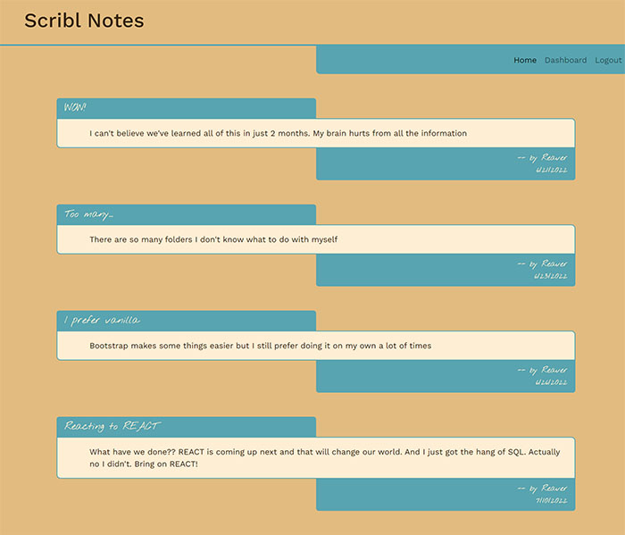
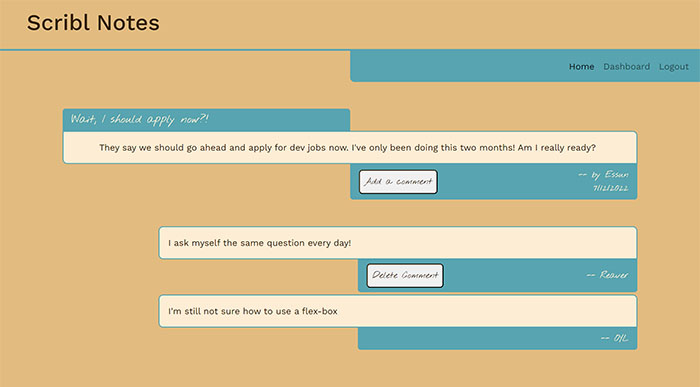

# Scribl Notes - A CMS Blogging Platform
A full-stack application for blogging and community engagement

## The 14th challenge in the UT-Austin Full Stack Development Bootcamp - Create an CMS system from scratch

___

As we enter the final third of our bootcamp, our challenge for the weekend was to develop a full-stack application from scratch. This was a huge challenge to do for the first time with little to no guidance other than online documentation and some class examples we could sometimes pattern match with. 

I quickly found out that my plan for the CMS didn't allow for much pattern matching beyond basic templating of the server and some routes. The rest was a lot of research and trial and error. 

In the end I think I created a good start on a solid CMS system. There are some UX issues that grate on my nerves in terms of error handling. THere also needs to be some work on the UI, but I wanted to try styling something different using mostly bootstrap again.

If you want to take the app for a test drive, here's the link to a live version currently hosted on Heroku.

___

## How to use

When you first get to the homepage, you'll see a list of posts from users. If you click on a post you'll immediately be redirected to either login or sign up for the community.

Once you login, you'll be taken to your personal Dashboard. This page lists all of your previous posts that you've made. You'll also have the option to create a new post. 

If you click on one of your existing posts from the Dashboard, you'll have the option to edit or completely delete your post.

If you go back to the Home page, if you click on a post to read you'll be taken to that page and shown any comments that have been left on the post. 

If you're the user who left a comment and are currently logged in, you'll have the option to delete your comment from the post.

___

## Changes Made and Lessons Learned

- I can't even begin to enumerate the number of lessons learned on this project. I'm honestly not sure I still understand all of them, but I understand how to make them work. My major problem was managing session storage in a way that I could add the functionality that I was looking for, specifically Delete buttons that were only available to logged in users for their own comments. With a lof of reading and an extra set of eyes from my classmate, we finally got it working. 

- I made a lot of headway in understanding Handlebars. While there are still a lot of things left to learn in using it, I do understand how to use custom helpers to add extra customization.
    - The biggest confusion for me was in reading variables that were passed to templates from my API routes. I would get a value on the main template and then return undefined on a partial. Richard from class showed me how he found to pass on variable definitions to make sure they made it through the levels of templates and partials. I'm still not sure where he found that information but it was a lifesaver.

- I spent more time with MySQL Workbench. A lot of time. While there's still a lot of functionality to learn, I do feel like I'm getting the hang of it and it became indispensible when troubleshooting. 

- I learned just how many moving pieces are in a full-stack app and how one little tweak to a function can bring the whole thing down. Not that it ever happened to me. Nope. Never.

___

## Possible Future Changes

- I really want to have a better UX with error messages for users trying to login or signup. As of right now the error messages are not very helpful alerts. That will take some time to fix but I do want to add that ability.

- I would like for this to work with longer posts, but I'm afraid the home page isn't designed for that yet. I need to add some ability to post snippets to the Home page with a "read more..." link encouraging people to click through.

- I want the dashboard to show all of a user's activity, including comments. Right now it just shows posts but with a little extra code I can add that functionality in. 

- Some of the font choices aren't my favorite. I wanted to go for a relaxed vibe, like LoFi Hip Hop radio. I'm not sure I accomplished it but I'd like to keep working on the look and feel.

- I have an idea for a logo I'd really like to create to give it an even more casual and comfortable feel.

___

## Credits

Huge thanks for [Richard](https://github.com/richardjhong) for helping me squash bugs and figure out how to pass variables down to partials in Handlebars.

Thanks to Leah, Ian, Diem, Negin, and all the other students who keep teaching and talking us through all the twists and turns of coding.

___

## License

MIT License

Copyright (c) 2022 Mark Gardner

Permission is hereby granted, free of charge, to any person obtaining a copy
of this software and associated documentation files (the "Software"), to deal
in the Software without restriction, including without limitation the rights
to use, copy, modify, merge, publish, distribute, sublicense, and/or sell
copies of the Software, and to permit persons to whom the Software is
furnished to do so, subject to the following conditions:

The above copyright notice and this permission notice shall be included in all
copies or substantial portions of the Software.

THE SOFTWARE IS PROVIDED "AS IS", WITHOUT WARRANTY OF ANY KIND, EXPRESS OR
IMPLIED, INCLUDING BUT NOT LIMITED TO THE WARRANTIES OF MERCHANTABILITY,
FITNESS FOR A PARTICULAR PURPOSE AND NONINFRINGEMENT. IN NO EVENT SHALL THE
AUTHORS OR COPYRIGHT HOLDERS BE LIABLE FOR ANY CLAIM, DAMAGES OR OTHER
LIABILITY, WHETHER IN AN ACTION OF CONTRACT, TORT OR OTHERWISE, ARISING FROM,
OUT OF OR IN CONNECTION WITH THE SOFTWARE OR THE USE OR OTHER DEALINGS IN THE
SOFTWARE.
